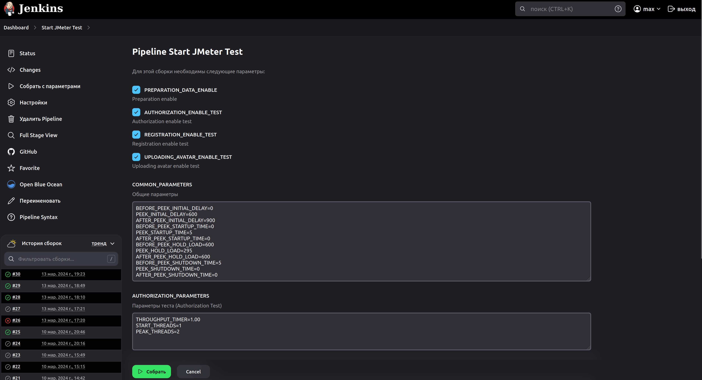
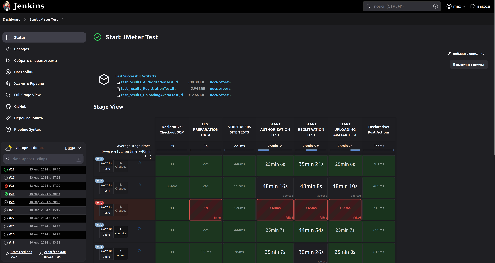
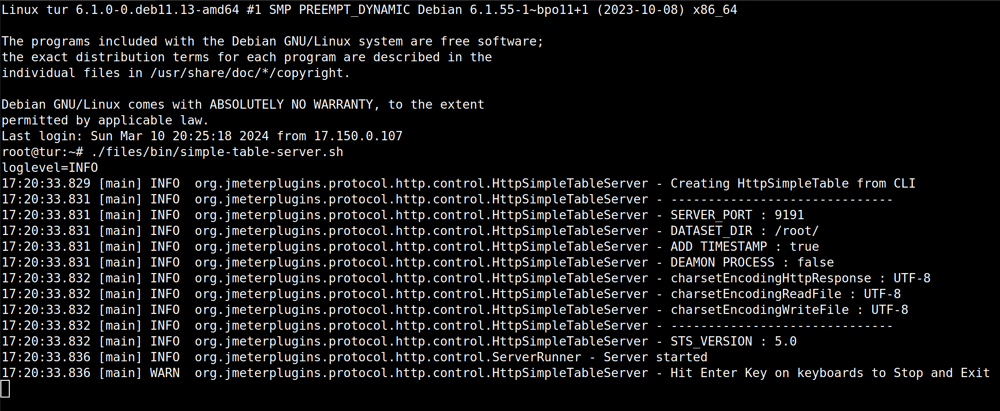
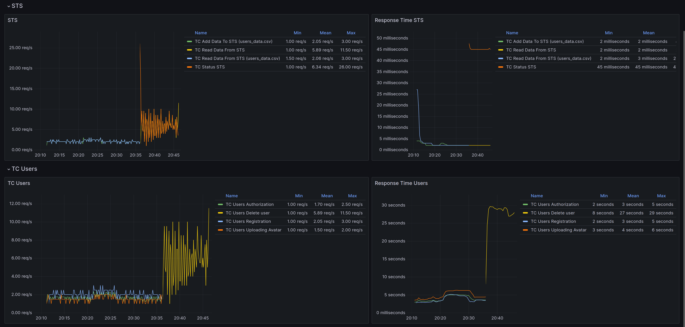

# JMeter-Tests-Users
Тестирование сайта <a href="http://users.bugred.ru/">Users</a> (Нагрузочное тестирование)

## Описание

Цель проекта: получение навыков в написание автоматизированных нагрузочных авто тестов на JMeter. Сайт для тестирования (<a href="http://users.bugred.ru/">Users</a>).

## Технологии

- JMeter
- Jenkins
- Grafana
- Grafana
- InfluxDB
- Simple Table Server

## Состав проекта

- Папка (jenkins) с pipeline
- Папка (tests) с нагрузочными тестами
- Папка (test_data) с данными для теста
- Скрипт (pre_generate_users) для генерации даных в STS

## Параметры запуска

### Jenkins

Параметры запуска:

Запущенные тесты:

### Console

./apache-jmeter/bin/jmeter.sh -n -t ./tests/AuthorizationTest.jmx -J {Название параметра}={Значение} -l ./logs/2024-03-13_18-10-40/test_results_AuthorizationTest.jtl

## Настройка STS

Запуск Simple Table Server

## Мониторинг

Дашборды в Grafana

